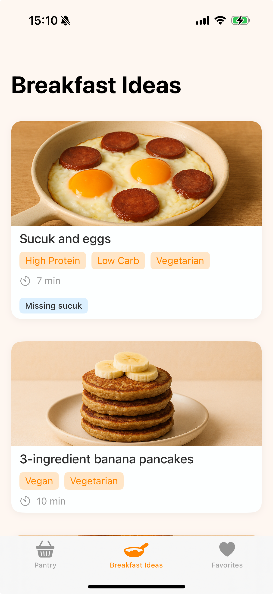
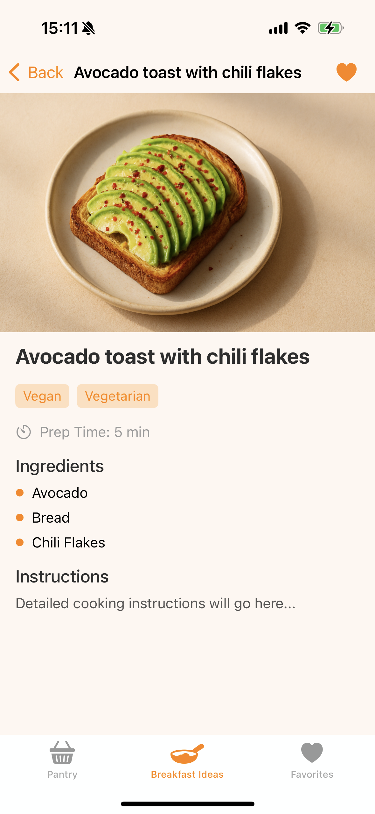
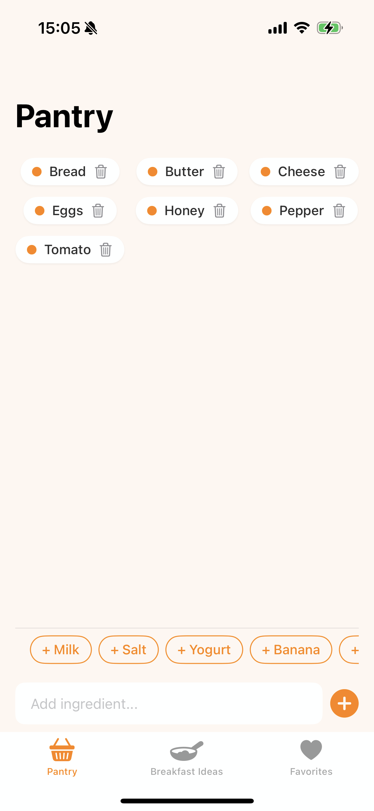

# BreakfastApp

## Description

BreakfastApp helps you discover delicious breakfast recipes based on the ingredients you already have in your pantry. Stop wondering what to make and start enjoying your mornings!

## Features

*   **Pantry Management:** Easily add, remove, and track the ingredients you have on hand.
*   **Recipe Suggestions:** Get personalized breakfast recipe ideas based on your available ingredients.
*   **Missing Ingredient Highlighting:** Quickly see if you're just one or two ingredients away from a tasty meal.
*   **Intuitive Interface:** Clean and simple design focused on ease of use.

## Screenshots


_Breakfast Ideas: See recipes based on your pantry._


_Recipe Details: View ingredients and instructions._


_Pantry: Manage your available ingredients._


_Favorites: Save your most loved recipes._

## Technology Stack

*   **Language:** Swift
*   **UI Framework:** SwiftUI
*   **Platform:** iOS
*   _(Add other key libraries or technologies used, e.g., Core Data, Combine)_

## Setup and Installation

To build and run the BreakfastApp locally:

1.  **Clone the repository:**
    ```bash
    git clone https://github.com/bhkrdn/BreakfastApp
    cd BreakfastApp
    ```

2.  **Open the project:**
    Open the `.xcodeproj` or `.xcworkspace` file located in the `BreakfastApp` directory using Xcode.

3.  **Build and Run:**
    Select an iOS simulator or connect a physical device, then press the Run button (or `Cmd+R`) in Xcode.
